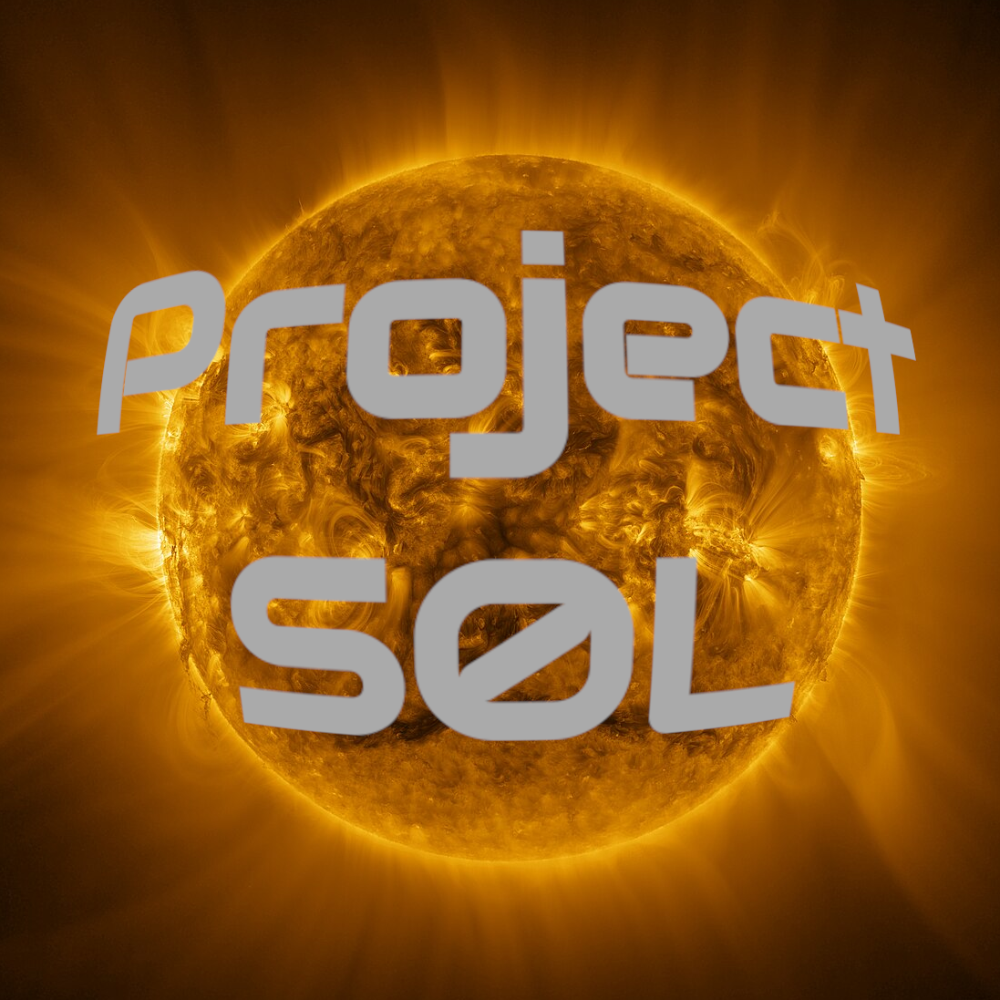

  

## Estructura
* [quest/](quest/): retos del proyecto SOL
* [src/](src/): base de código común para todos los quests
* [doc/](doc/): documentación del proyecto
* [test/](test/): tests unitarios de la base de código
* [tool/](tool/): herramientas para el mantenimiento del proyecto
