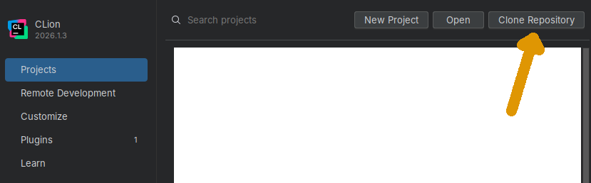
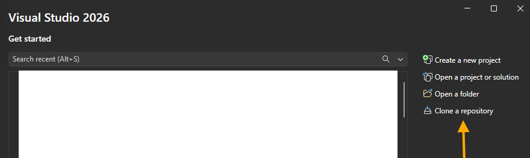
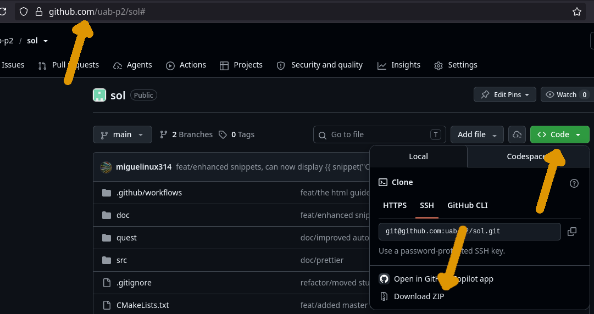
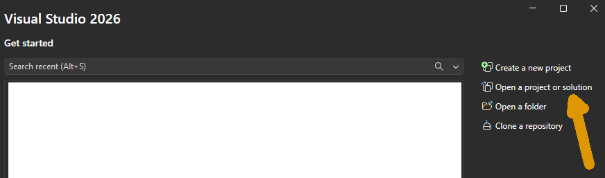

# Silicio y titanio

Tu primera misión es configurar un buen entorno de desarrollo
que te sirva para todo el proyecto. Primero te ayudamos a instalar
todo lo necesario. Después, te proponemos una prueba de humo.

## Sistema operativo

Tu primera decisión debe ser qué sistema operativo utilizar.
Las principales opciones compatibles con el proyecto SOL son:

- Linux (p.ej., [Kubuntu](https://kubuntu.org/)
  o [linuxmint](https://www.linuxmint.com/))
- Windows
- MacOS

Te animamos a explorar un sistema dual boot Linux + Windows/MacOS
para que puedas comparar las diferencias.

## Entorno de desarrollo y compiladores

Los principales entornos de desarrollo integrado (IDEs)
disponibles en la mayoría de plataformas son:

- [Jetbrains CLion](https://www.jetbrains.com/clion/):
  gratis para usos no comerciales. Recomendado instalar
  a trevés del Toolbox de Jetbrains.
- [Visual Studio 2026](https://visualstudio.microsoft.com/downloads/):
  version Community gratuita.

Si utilizas Linux en la línea de comandos (CLI), tan sólo necesitarás
instalar los paquetes básicos de compilación, como por ejemplo (debian/ubuntu):

```bash
apt install build-essential gdb valrgind cmake git
```

## Prueba de humo

Una prueba de humo consiste en enchufar un aparato nuevo o recién arreglado
para comprobar si empieza a quemarse o si funciona bien. Te proponemos una
prueba de humo para tu nuevo y flamante plataforma de desarrollo: compilar
el código tu primer quest del proyecto SOL (este).

### Paso 1/3: Obtén el código fuente del proyecto SOL

Tienes todo el código fuente del
[proyecto SOL en github](https://github.com/uab-p2/sol). La dirección
del repositorio git es `https://github.com/uab-p2/sol.git`.

El objetivo es crear una carpeta en tu disco duro con todos los contenidos.
Puedes descargarlos de varias maneras:

* **Opción 1**: Clona el repositorio con CLion, introduce la dirección del respositorio
  git y la carpeta donde quieres guardar el código.

  

* **Opción 2**: Clona el repositorio con VisualStudio, introduce la dirección del respositorio
  git y la carpeta donde quieres guardar el código.

  

* **Opción 3**: Clona el repositorio con `git clone https://github.com/uab-p2/sol.git`.

   ```bash
   $ git clone https://github.com/uab-p2/sol.git
   Cloning into 'sol'...
   remote: Enumerating objects: 492, done.
   remote: Counting objects: 100% (472/472), done.
   remote: Compressing objects: 100% (235/235), done.
   remote: Total 492 (delta 202), reused 423 (delta 160), pack-reused 20 (from 1)
   Receiving objects: 100% (492/492), 6.09 MiB | 6.51 MiB/s, done.
   Resolving deltas: 100% (204/204), done.

   $ ls sol/
   doc  Makefile  quest  src  README.md  CMakeLists.txt
   ```

* **Opción 4**: Descarga y descomprime el [`.zip` del proyecto sol.](https://github.com/uab-p2/sol/archive/refs/heads/main.zip)

  

### Paso 2/3: Abre el quest 'Silicio y titanio'

!!!info
    Todos los quests se abren de la misma manera.

Una vez tengas guardado el proyecto en, digamos, `sol/`
necesitamos entrar en la carpeta `sol/quest/silicio_y_titanio`.

Dentro de esta carpeta, el fichero `CMakeLists.txt` contiene
la configuración para que tu entorno de desarrollo pueda compilar el quest.
Dependiendo de tu IDE:

* CLion: Usando el menú `File` -> `Open`, selecciona este `CMakeLists.txt`
  y elige abrirlo como un proyecto.

  

* Visual Studio: Opción `Open a project or solution` en el menú inicial.

  

  A continuación, activa la vista "cmake targets":

  

### Paso 3/3: Compilar y ejecutar

* En CLion, pulsa el botón play en la barra de herramientas.

  

* En Visual Studio, pulsa el botón play en la barra de herramientas.

  


* Si usas la línea de comandos en Linux o MacOS, también puedes compilar
  a mano con los siguientes comandos

    ```bash
    # Ir a la carpeta del quest
    cd sol/quest/silicio_y_titanio
    # Compilar 
    make
    # Ejecutar
    ./main
    ```

### Resultado

Si todo ha ido bien, deberías ver un mensaje indicando cómo se compara
la velocidad de tu máquina con la de la mía. ¿Cuál de las dos nos lleva más rápido?

<br/><br/>
[&rightarrow; Repositorio](https://github.com/uab-p2/sol/tree/main//quest/silicio_y_titanio)
