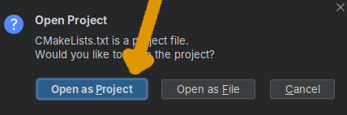

# Apertura de un quest en el IDE

Carga el código de un quest en tu IDE y déjalo listo para
trabajar y compilar.

En primer lugar, necesitas haber descargado el código completo 
del proyecto. Tienes las instrucciones en {{ codex_link("clone_project") }}.
A continuación, necesitas saber cuál de los quests quieres abrir. Cada uno 
es un projecto de código independiente.

!!!info
    Todos los quests se abren de la misma manera.

Si queremos abrir el quest 'Silicio y titanio', por ejemplo, y tenemos el código en la carpeta `sol/`,
entonces necesitamos entrar en la carpeta `sol/quest/silicio_y_titanio`.
Dentro de esta carpeta, el fichero `CMakeLists.txt` contiene
la configuración para que tu entorno de desarrollo pueda compilar el quest.
Dependiendo de tu IDE:

## Apertura con CLion

Usando el menú `File` -> `Open`, selecciona este `CMakeLists.txt`
y elige abrirlo como un proyecto.

## Apertura con Visual Studio

Opción `Open a project or solution` en el menú inicial.

A continuación, activa la vista "cmake targets":

