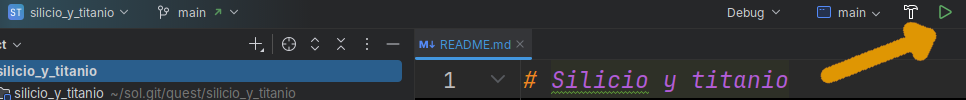
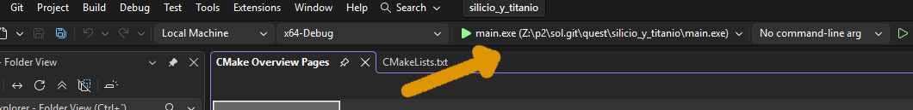

# Compilación y ejecución un quest

Aprende a compilar y ejecutar el código de un quest
abierto en tu IDE favorito. 

Si no sabes cómo abrirlo, visita {{ codex_link("open_quest") }}.

Pongamos que tenemos el quest {{ quest_title("silicio_y_titanio") }}
abierto.

## Compilar y ejecutar en CLion

En primer lugar, elige `main` (para el código en `main.cpp`)
o `test` (para el código en `test.cpp`).
A continuación, pulsa el botón play en la barra de herramientas.



Puedes usar el símbolo de la herramienta para configurar 
los argumentos por línea de comandos que se reciben en
```int argc, char* argv[]``` de ```main```.

## Compilar y ejecutar en Visual Studio

En primer lugar, elige `main.exe` (para el código en `main.cpp`)
o `test.exe` (para el código en `test.cpp`).
A continuación, pulsa el botón play en la barra de herramientas.



Puedes usar la caja contigua para
los argumentos por línea de comandos que se reciben en
```int argc, char* argv[]``` de ```main```.


## Compilar y ejecutar en la línea de comandos (CLI) 

Compila y ejecuta fácilmente con los siguientes comandos:

```bash
# Ir a la carpeta del quest
cd sol/quest/silicio_y_titanio

# Compilar 
make

# Ejecutar el código de main.cpp
./main

# Ejecutar el código de test.cpp
./test
```
