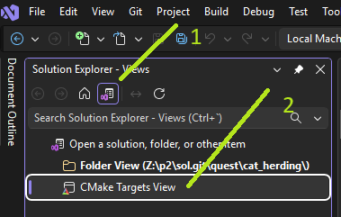

# Entre gatos

El objetivo de este quest es familiarizarte con la mentalidad felina
a través del uso de *clases*, también conocido como *programación orientada a objetos (OOP)*.
Te ofrecemos un puñado de preguntas guiadas, tras las cuales te proponemos un reto final.

0. Descarga el proyecto SOL y abre `CMakeLists.txt` con tu IDE favorito.
   Puedes descargarlo:
    - Manualmente desde [github](https://github.com/uab-p2/sol/archive/refs/heads/main.zip).
    - Mediante `git`, con `git clone https://github.com/uab-p2/sol`.
    - Con la opción "Clone repository" en Visual Studio.

   Si usas Visual Studio, activa la vista "cmake targets":
   

      
   

1. Ejecuta la demo proporcionada y estudia su salida.
    - ¿En qué estados puede estar un gato?
    - ¿Qué acciones afectan el estado de un gato?
    - Dibuja el diagrama de estados de un gato.

2. Estudia el contenido de [main.cpp](main.cpp).
    - ¿Qué elementos del código conocías ya?
    - ¿Qué partes no conoces todavía?
    - ¿Hay alguna parte repetitiva que puedas mejorar?

3. Juega con [main.cpp](main.cpp).
    - Crea otro gato llamado "Gatélite".
    - ¿Se comporta Gatélite igual que Nyan?
    - Predice: ¿es posible tener un gato satisfecho (ni hambriendo ni somnoliento)?
    - Predice: ¿es posible crear un gato sin nombre?

4. Estudia el contenido de [../../src/cat.h](../../src/cat.h) y [../../src/cat.cpp](../../src/cat.cpp).
    - ¿Qué hay en el `.h` que no hay en el `.cpp`?
    - ¿Qué hay en el `.cpp` que no hay en el `.h`?
    - Corrobora o desmiente las dos predicciones del punto anterior.
    - ¿Es posible conocer el estado del gato sin jugar ni darle comida?

5. Reflexiona sobre lo que has observado:
    - Haz una tabla resumen con (a) la nueva sintaxis aprendida, y (b) para qué sirve.
    - ¿Hay algún aspecto todavía misterioso?

Casi todos los gatos prefieren tener una persona ~~esclava~~ cuidadora.
Modifica [main.cpp](main.cpp) (pero no modifiques [../../src/cat.h](../../src/cat.h)
ni [../../src/cat.cpp](../../src/cat.cpp)) para que implemente una nueva demo de tu cosecha.
Esta demo debe crear al menos una nueva clase `Caregiver` (puedes crear más clases si quieres)
que pueda interactuar con la clase `Cat`. Antes de programar nada:

- Crea un diagrama de estados de `Caregiver`.
- Dibuja un diagrama de carriles (swimlane) con el guión de tu demo.

# Tags

oop, encapsulation, diagram
