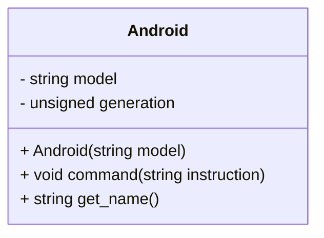

# Clonación

Como es habitual en cualquier instalación científica en {{ future_year() }},
la estación SOL dispone de un laboratorio de clonación, pero también les
está comenzando a fallar. Estamos prototipando unos androides autoclonables
que puedan usar. ¿Nos echas un cable?


{{ img_badge("cloning.png") }}

{{ goals(
    "Implementa constructores copia.",
    "Implementa operadores asignación.",
    "Practica las interacciones entre composición y constructores.",
    "Utiliza copias y referencias de instancias `std::vector`."
) }}

## Androides autoclonables

### Diseño inicial

El diseño del androide que queremos crear está únicamente comenzado.
Sabemos que queremos una clase `Android` con la siguiente interfaz pública
y funcionalidad:



1. Creación en fábrica.<br/>Se crea un androide de generación 0 y el 
   nombre de modelo dado.

{{ snippet_box("Android::Android", declaration=True, indent=1) }}

2. Instrucciones.<br/>El siguiente método permite indicarle al 
   androide qué hacer. El androide no "hace" nada, pero almacena
   la instrucción por seguridad.

{{ snippet_box("Android::command", declaration=True, indent=1) }}

3. Identificación.<br/>Cada androide podrá identificarse. Lo hará
   en base a su nombre de modelo y su número de generación:

{{ snippet_box("Android::get_name", declaration=True, indent=1) }}

4. Informe final.<br/>Al terminar la vida útil de cada objeto Android,
   éste ha de reportar el listado de instrucciones que ha recibido. 
   Lo hará con formato `<name>:<instrucción1>,<instrucción2>,...<std::endl>`:

:::compile_and_run title="Ejemplo con el diseño básico" indent=1
#include "android.h"

int main(void) {
    Android android("prototype");

    android.command("look at me");
    android.command("remove a limb");
}
:::

!!! questions

    * Implementa este diseño básico en `android.h` y `android.cpp`
      y verifica su funcionamiento localmente.

{{ codex_links("class_constructor") }}

### Clonación

Además de lo anterior, queremos poder "clonar" los objetos de tipo `Android`
para que puedan multiplicarse una vez en la estación SOL. 
Los requisitos de esta parte son:

1. Nombre y generación.<br/>
   El clon mantiene el nombre de modelo del original, pero incrementa 
   su número de generación en 1.

2. Registro de órdenes.<br/>
   El clon no recuerda las órdenes que realizó el original (por privacidad), 
   pero registra `"original had N"` como su primera 
   instrucción recibida, donde `N` es el número de
   órdenes que ha recibido el original en el momento de la clonación.

3. Construcción por copia y asignación.<br/>
   Queremos poder usar tanto la sintaxis A como la sintaxis B 
   para realizar las "clonaciones" (hay dos versiones de la sintaxis A).

:::compile_and_run title="Ejemplo de clonación (cumple requisitos)"
#include <iostream>
#include "android.h"
using namespace std;

int main() {
    Android original("panda");
    original.command("you are the original");

    // Syntax A
    Android copy1(original);
    Android copy2 = original;

    copy1.command("you are copy 1");
    copy2.command("you are copy 2");

    // Syntax B
    copy2 = original;
    copy2.command("you are still copy 2");

    return 0;
}
:::

!!! questions

    * Explica la salida del ejemplo anterior. 
      ¿A qué variable corresponde cada línea de la salida?
      

    * Usando el "diseño inicial" que acabas de implementar,
      la ejecución del ejemplo debería producir la salida mostrada.
      ¿Cuáles de los requisitos anteriores se están cumpliendo?
      ¿Qué ha hecho el compilador automáticamente?
      
      ```test linenums="1"
      panda-gen0:you are the original,you are still copy 2
      panda-gen0:you are the original,you are copy 1
      panda-gen0:you are the original
      ```

    * Completa la implementación de `Android` para cumplir todos los
      requisitos anteriores.


{{ codex_links("class_destructor", "class_copy_constructor", "class_assignment") }}

## Multiclonación

Para la estación SOL, el verdadero valor de estos androides reside en poder
hacer múltiples copias a la vez, en lugar de hacerlas de una en una.

### Vectorización 

Una herramienta útil para representar "lotes" de androides es `std::vector<Android>`.
Considera cómo interactúa con la copia de objetos:

:::compile_and_run title="Ejemplo `std::vector<Android>::push_back`"
#include <iostream>
#include <vector>
#include "android.h"
using namespace std;

void process(vector<Android> batch) {
    cout << "Processing " << batch.size() << " androids..." << endl;
}

int main() {
    Android original("giskard");
    original.command("stay still");
    
    std::vector<Android> batch;
    batch.push_back(original);

    process(batch);
    cout << "Processing finished." << endl;

    return 0;
}
:::

!!! questions

    * La llamada a `push_back`, ¿produce alguna copia?
    * La llamada a `process`, ¿produce alguna copia?
    * ¿Qué cambia si modificamos process para tener la siguiente cabecera?
      
          ```cpp
          void process(vector<Android>& batch);
          ```
    * ¿Y si retornamos el objeto batch cambiando `void` por `vector<Android>`?    

### Clonación por lotes

La estación SOL agradecerá tener una variedad de opciones para clonar
androides. Utilizando lo anterior, te proponemos crear una clase `BatchCloner`
que permita clonar o generar lotes de androides. 

Tú decides la funcionalidad e interfaz pública concretos que quieres ofrecerles.

!!! questions

    * Diseña y documenta la interfaz de una clase `BatchCloner` en `batch_cloner.h`
      que permita multiplicar rápidamente el número de androides usando vectores.  

    * Implementa los métodos de tu clase en `batch_cloner.cpp`, y crea una demo 
      en `main.cpp` que muestre su funcionamiento.

    * Compara tu solución con otras. ¿Qué es común a todas ellas?

# Tags
en_ruta:5
session:4
