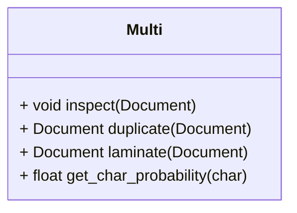

# Comunicación

La comunicación asíncrona vía documentos es particularmente crítica 
para una estación espacial como SOL. Otro de los aparatos que necesitan
reparar (y que tu equipo puede producir) es la máquina multifunción 
para procesar documentos. Te retamos a plasmar con código la diferencia
entre original y copia, entre permitido y prohibido.

{{ img_badge("tablet.png") }}

{{ goals(
    "Parámetros por valor y por referencia.",
    "Objetos, parámetros y métodos const.",
    "Definición y uso de constructores copia.",
) }}

## Documentos

La clase {{ snippet_signature("Document") }} implementa un trozo de papel digital. 
Incorpora un id que se establece en la creación, y un número de secuencia
que se incrementa en las copias o al modificar un documento.

:::compile_and_run title="Ejemplo de uso de `Document`"
#include <iostream>
#include "document.h"
using namespace std;

int main() {
    // Create document
    Document document("content", "id123");
    cout << "Original:" << endl << document << endl;

    // Add extra content
    document.add_content(" and more content");    
    cout << endl << "Modified:" << endl << document << endl;

    // Verify the document id
    cout << endl;
    cout << "Verification A: " << document.verify_id("id123") << endl;
    cout << "Verification B: " << document.verify_id("wrong_id") << endl;

    return 0;
}
:::

Estudia `document.h|cpp` y responde a lo siguiente. 
Cuando sea posible, incluye ejemplos de código que confirmen 
tus respuestas en `test.cpp`. 

!!! questions

    * Lista los elementos conocidos y los elementos desconocidos en `document.h`.

    * Dado un objeto tipo `Document`, ¿es posible cambiar su id? ¿Y conocerla?

    * ¿Qué puede alterar el número de secuencia de un objeto `Document`?

    * ¿Es posible modificar el contenido de manera indetectable? 
      Lista métodos/estrategias que funcionan y que no funcionan.

{{ snippet_box("document.h") }}

{{ snippet_box("document.cpp") }}

{{ codex_links(
    "class_encapsulation", 
    "class_copy_constructor",
) }}

## Máquina multifunción

El material, la forma y hasta el contenido pueden ser iguales en un libro y un cuaderno.
Una diferencia estriba en que podemos hacer con el objeto: sólo uno de los dos nos
invita a modificarlo. Profundicemos en esta diferencia mientras trabajamos en 
la máquina multifunción que nos han pedido.

Necesitamos producir una clase `Multi` en `multi.h|cpp` con el siguiente interfaz
pública (no es código C++).

### Copia y laminación 

Los métodos públicos de la máquina `Multi` son:

* `inspect` 
   
      1. La máquina toma un documento y, sin copiarlo ni modificarlo, lee su contenido.
         En la siguiente sección veremos qué hace la máquina con este contenido.

      2. La máquina no genera ningún documento. 

* `duplicate` 

      1. La máquina toma un documento y, sin modificarlo, primero lo inspecciona (`inspect`)
         y luego produce su duplicado.

      2. Este duplicado tiene el mismo id y contenido que el original, 
         pero tiene el siguiente número de secuencia. 
      
      3. Tres maneras (las dos primeras, equivalentes) 
         de duplicar un documento son:

:::compile_and_run indent=2 title="Uso de `duplicate`"
#include <iostream>
#include "document.h"
using namespace std;

int main() {
    Document original("content", "id001");
    
    Document duplicate1(original);
    Document duplicate2 = duplicate1;
    Document duplicate3("garbage", "999");
    duplicate3 = duplicate2;

    cout << "Original:" << endl << original << endl << endl;
    cout << "Duplicate 1:" << endl << duplicate1 << endl << endl;
    cout << "Duplicate 2:" << endl << duplicate2 << endl << endl;
    cout << "Duplicate 3:" << endl << duplicate3 << endl << endl;
    
    cout << "Id verification: " << duplicate3.verify_id("id001") << endl;

    return 0;
}
:::

* `laminate` 

      1. Toma un documento, lo inspecciona (`inspect`) 
         y después lo lamina si no había sido laminado ya.

      2. El documento, al laminarse, añade la cadena `"\n{LAMINATED}"` al final.
         Este es el criterio usado para decidir si se lamina o ya había sido
         laminado.

      3. El número de secuencia del documento se incrementado en 1 al laminar.

      4. Al terminar la laminación, `laminate` devuelve el documento original
         (no una copia!) tras el laminado. El método `laminate` debe señalizar
         que este documento laminado retornado no se ha de modificar.

:::compile_and_run indent=2 title="Uso de `laminate`"
#include <iostream>
#include "multi.h"
using namespace std;

int main() {
  Document document("content", "id555");
  cout << "Original:" << endl << document << endl << endl;

  Multi multi;
  const Document& laminated = multi.laminate(document);
  cout << "Laminated:" << endl << laminated << endl << endl;
  
  bool is_laminated = laminated.get_content().ends_with("\n{LAMINATED}");
  cout << "Is laminated? " << (is_laminated ? "yes" : "no") << endl;
  cout << "Are same object? " << (&document == &laminated ? "yes" : "no") << endl;
}
:::

!!! questions

    * En los métodos `inspect`, `duplicate` y `laminate`, 
      ¿qué parametros son copias y qué parámetros son "originales" (referencias)?
      ¿cuáles son inmutables?
      ¿y los retornos?

    * Declara los métodos `inspect`, `duplicate` y `laminate` 
      de la clase `Multi` en `multi.h` de manera coherente con tu respuesta
      al punto anterior.

    * Implementa los métodos `duplicate` y `laminate`, así como 
      sus tests asociados en `test.cpp`. No implementes `inspect` todavía
      (deja una implementación vacía que compile).

{{ codex_links(
    "class_value_reference",
    "class_const",
) }}

### Inspección y análisis estadístico

* El método `inspect` no modifica ni copia el documento original, y no devuelve nada.
  Esta función sí lee el contenido del documento 
  y lleva la cuenta de cuántas veces aparece cada caracter (`char`) 
  en el contenido (`std::string`) de todos los documentos
  que se han inspeccionado hasta el momento.
  Recomendamos usar `std::map`.

* El método `get_char_probability` es la única que no modifica 
  el estado de la máquina `Multi` y simplemente devuelve la probabilidad
  de un caracter `c` específico. Esta probabilidad se calcula como el número
  total de apariciones de `c` dividido entre el número total de caracteres inspeccionados,
  \( P(c) = \frac{N_\text{c}}{N_\text{total}}\).

:::compile_and_run title="Uso de `get_char_probability`"
#include <iostream>
#include "multi.h"
using namespace std;

int main() {
    Document document("content", "id666");
    Multi multi;
    
    multi.inspect(document);
    for (char c : {'c', 'n', 't'}) {
        cout << "P('" << c << "') = " 
            << multi.get_char_probability(c) << endl;
    }

    return 0;
}
:::

!!! questions

    * Completa la declaración de `inspect` y `get_char_probability` en `multi.h`.

    * Implementa estos métodos con la funcionalidad requerida.

    * Explica lo observado en los dos siguientes casos, y extrapola al resto
      de combinaciones.

:::compile_and_run  inline=2 title="Caso A" fails open=false
#include <iostream>
#include "multi.h"
using namespace std;

int main() {
    const Multi multi;
    Document document("content", "id666");

    Document copy = multi.duplicate(document);

    return 0;
}
:::

:::compile_and_run inline=2 title="Caso B" fails open=false
#include <iostream>
#include "multi.h"
using namespace std;

int main() {
Multi multi;
const Document document("content", "id666");

    Document laminated = multi.laminate(document);

    return 0;
}
:::

{{ codex_links(
  "std_map",
) }}

# Tags
en_ruta:4
session:3
duration:60
