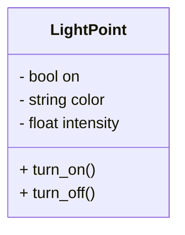
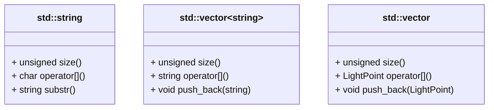

# Iluminación

Tu equipo es el encargado de prototipar un nuevo sistema de control de luces
para el proyecto SOL. Para ser compatible, deberás usar el mismo paradigma:
la programación orientada a objetos (OOP). Te invitamos a tomar contacto 
con la potencia de este paradigma.

{{ img_badge("light_string.png") }}

??? Objetivo
    - Descubre las ventajas de la programación orientada a objetos.
    - Implementa un sistema de control de luces utilizando clases ya implementadas.

## Puntos de luz

Toda la iluminación de la estación SOL es mediante puntos de luz individuales
e intercambiables. Cada uno:

* Puede encenderse y apagarse individualmente (on/off).
* Permite cambiar el color de la luz que emite.
* Si está encendido, se puede graduar la intensidad (0-1).

### Candelabros

Sin programación orientada a objetos, podríamos modelar los puntos de luz
con unas pocas variables y algunas funciones asociadas:

```cpp
int main() {
    // This is the light point
    bool is_on;
    string color;
    float intensity;
}

/// Turn on a light point
void turn_on(bool& is_on, string& color, float& intensity);
/// Turn off a light point
void turn_off(bool& is_on, string& color, float& intensity);
```

Tienes el ejemplo completo en el `main.cpp` de este quest:

:::compile_and_run quest
::: 

Sin programación orientada a objetos:

!!! questions

    * ¿Cuántas variables necesitamos para 2 puntos de luz? ¿Y para 10?
    * ¿Cómo podemos garantizar que no cruzamos los argumentos (`is_on`, `color`, ...)
     de dos puntos de luz diferentes al llamar a `turn_on` y luego a `turn_off`?
    * Queremos contar cuántas veces se enciende y se apaga cada luz.
          * ¿Cómo lo modelarías?
          * ¿En cuántos sitios necesitamos cambiar nuestro código si tenemos 2 puntos de luz?
          * ¿Y si tenemos 10?
    * ¿Es posible confundir el `turn_on` the una lámpara con el de una lavadora?
    * ¿Cómo podríamos hacer que todas las luces comiencen encendidas?
     Nos gustaría evitar algo como lo siguiente:


:::compile_and_run
#include <iostream>
#include <string>
using namespace std;

int main() {
    bool is_on;
    string color;
    float intensity;

    cout << (is_on ? "On" : "Off") << ":" << color << intensity << endl;

    return 0;
}
:::

### Bombillas

Si usamos programación orientada a objetos, podemos agrupar los datos
(las variables de estado) y las funciones (los métodos) para crear *clases*,
como por ejemplo la clase `LightPoint`.



La *cabecera* de la clase describe qué atributos (datos) y métodos (funciones) tiene esa clase,
y quién puede usarlos:
{{ snippet_box("LightPoint") }}

La *implementación* de los métodos de la clase se incluyen en el `.cpp` correspondiente.
Estos métodos tienen acceso a los atributos de su clase
{{ snippet_box("light_point.cpp") }}

Considera el siguiente ejemplo de *uso* de la clase `LightPoint`:

:::compile_and_run
#include <iostream>
#include "light_point.h"

int main() {
    LightPoint light1(true, "white", 0.5);
    std::cout << "Light 1, before: " << light1.status() << std::endl;
    light1.turn_off();
    std::cout << "Light 1, after:  " << light1.status() << std::endl;
    
    LightPoint light2(false, "red", 0.2);
    std::cout << "Light 2, before: " << light2.status() << std::endl;
    light2.turn_on();
    std::cout << "Light 2, after:  " << light2.status() << std::endl;

    return 0;
}
:::

Estudia el código anterior y extrapola:

!!! questions

     * ¿Cuál es la diferencia entre clase y objeto?
     * ¿Cómo se crea un objeto (o *instancia*) de una clase?
     * ¿Cómo se invocan los métodos de un objeto?
     * ¿Qué variables usan los métodos de un objeto?
     * Si quisiéramos contar cuántas veces se enciende y se apaga cada luz,
        ¿qué ficheros necesitaríamos cambiar? ¿Pasa algo si ha hemos distribuido
        el código y lo están usando otras personas?

{{ codex_links("class_syntax") }}

### Tiras LED

El resto de clases funcionan igual que `LightPoint`. Por tanto, ya puedes aprovechar
la potencia del código escrito y mantenido por miles de personas en todo el mundo.
Hoy proponemos que uses:



* Clase `std::string` (`#include <string>`)<br/>
  Representa una cadena de caracteres.

       - Método `size()`: número de caracteres en la cadena.

       - Corchetes `[i]`: permiten acceder directamente al i-ésimo caracter de la cadena. 

       - Método `substr(int pos, int len)`: subcadena de `len` caracteres empezando en `pos`.

* Clase `std::vector<string>`: lista dinámica de objetos `string`.

       - Método `size()`: obtiene la longitud actual de la secuencia (número de objetos en la lista) 

       - Corchetes `[i]`: permiten acceder directamente al i-ésimo elemento de la secuencia.

       - Método `push_back(const string& s)`: añade una cadena al final de la secuencia.
        (No hay límite de tamaño para la secuencia).

* Clase `std::vector<LightPoint>`: como `std::vector<string>`, pero almacena 
  objetos de la clase `LightPoint` en lugar de `string`.


El siguiente ejemplo los pone todos en uso:

:::compile_and_run
#include <iostream>
#include <string>
#include <vector>
#include "light_point.h"

using namespace std;

int main() {
    string color1 = "red";
    string color2 = "blue";

    cout << "Create, add, access vector:" << endl;
    vector<string> colors;
    colors.push_back(color1);
    colors.push_back(color2);
    cout << "variables: " << color1 << ", " << color2 << endl;
    cout << "vector:    " << colors[0] << ", " << colors[1] << endl;

    cout << endl << "Modify vector element:" << endl;
    colors[1] = colors[1].substr(1, 2);
    cout << "variables: " << color1 << ", " << color2 << endl;
    cout << "vector:    " << colors[0] << ", " << colors[1] << endl;

    cout << endl << "Access the sequence of elements:" << endl;
    for (string& color : colors) {
        cout << "element:    " << color << endl;
    }

    return 0;
}
:::

!!! questions

    * Implementa la función {{ snippet_ref("receive_lights", include_declarations=True) }} 
      en `light_jockey.h/cpp`. Esta función lee de teclado una secuencia de códigos indicando
      el color y estado on/off de las luces existentes y devuelve un array de objetos `LightPoint`
      con esos colores y estados.

{{ snippet_box("receive_lights", include_declarations=True, default_open=True) }}

{{ codex_links("cin_cout", "std_string", "std_vector") }}

## Light Jockey

Te proponemos implementar un sistema de control de luces para la estación SOL.
Prepárate, pues es posible que tengas que trabajar con miles o millones 
de puntos de luz.

!!! questions

    * Implementa el método `control_lights` en `light_jockey.h/cpp`:
    
        * El método `control_lights` comienza recibiendo por teclado una secuencia con el mismo formato 
          y significado que la esperada por `receive_lights` de la sección anterior.
          No debe haber límite para la cantidad de luces.
        
        * Tras recibir la secuencia de luces anterior, el método `control_lights` recibe
          palabras/comandos adicionales por teclado. Tú decides qué palabras/comandos 
          reconocerá el sistema y significado. Algunas ideas:
          
            * "ALLON"/"REDOFF":  encender/apagar todas las luces, o sólo algunas.
            * "ADDRED"/"ADDBLUE"/...: añadir nuevas luces a la secuencia.
            * "DIMRED000"/"DIMRED001"/.../"DIMRED999":  cambiar la intensidad de las luces rojas
        
        * Escribe una demo en `main.cpp` que muestre su funcionamiento.

{{ snippet_box("control_lights", include_declarations=True, default_open=True) }}

A continuación puedes ver un ejemplo de salida si se implementa (y recibe) el comando "ALLOFF": 

:::compile_and_run solution input="2\nwhion\nredoff\nALLOFF"
:::

# Tags
en_ruta:0
day:1
time:60

