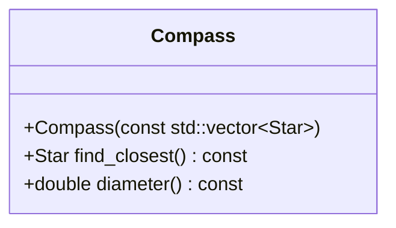

# Navegación

El sistema de navegación de la estación SOL usa la versión moderna
de uno de los métodos más antiguos: las estrellas. Te invitamos a
estudiar primero la clase `Star` para profundizar en cómo se crean los objetos,
y qué partes quedan accesibles u ocultas. Después, te proponemos
implementar un elemento clave del sistema de navegación de la estación.

{{ img_badge("observation.png") }}

{{ goals(
    "Razona acerca de los constructores de una clase.",
    "Deduce las reglas y diferencias que rigen la interfaz pública y privada de una clase.",
    "Implementa una nueva clase cumpliendo los requisitos propuestos."
) }}

## Estrellas

### Discretas

Estudia el código de la clase `Star` y un ejemplo de su uso.

{{ snippet_box("star.h") }}

{{ snippet_box("star.cpp") }}

{{ snippet_box("main.cpp") }}

!!! questions
 
      * ¿Qué código crea una clase y qué código un objeto?
      * ¿En qué se parecen/diferencian los "métodos" que se llaman igual que la clase
        (se llaman *constructores*) y el resto de métodos?
      * Explica la salida del siguiente código y comprueba con tu IDE 
        si es posible obtener algo igual de bizarro con la clase `Star`.
      * Propón ventajas e inconvenientes del uso de constructores.

:::compile_and_run
#include <iostream>
using namespace std;

class Planet { 
public:
   void report() {
      cout << radius << "m ";
      cout << (radioactive ? "danger" : "safe") << endl;
   }
protected:
    int radius;
    bool radioactive;
};

int main() {
   Planet pluto;
   pluto.report();
   return 0;
}
::: 

{{ codex_links("class_syntax", "class_constructor") }}

### Inalcanzables

`Star`, como todos los objetos, muestra una parte accesible para todas 
las demás clases y oculta otra, accesible sólo para la propia clase `Star`.
Te invitamos a jugar con `main.cpp` para deducir las
reglas y sintaxis de este sistema llamado *encapsulamiento*.

!!! questions

      * ¿Es posible crear una estrella de cualquier tipo?
      * Una vez creada una estrella, ¿es posible renombrar una estrella a "SOL"?
      * ¿Se puede cambiar su `wavelength` a 150 nm? ¿Y a 145 nm?
      * ¿Qué significado crees que tiene el prefijo `m_`?
      * Dibuja un diagrama de clase para `Star` como el mostrado 
        en {{ quest_link("iluminacion") }} para `LightPoint`
      * Discute ventajas e inconvenientes de usar encapsulamiento.

{{ codex_links("class_encapsulation") }}

## Brújula celeste

La estación SOL necesita tu ayuda para reparar un subsistema de navegación.
Te han pedido que encapsules dos funcionalidades críticas.

!!! questions

      * Crea la clase `Compass` cumpliendo con los siguientes requisitos.

* Los ficheros `compass.h` y `compass.cpp` contienen la implementación de la clase `Compass`.

* Se puede crear un objeto clase `Compass` pasándole un catálogo
  de estrellas de tipo `const std::vector<Star>`.
   
* Se puede buscar la estrella del catálogo más cercana (en posición) a una buscada
  con un método `Star Compass::find_closest(const Star& search) const`.
  Este sistema ha salvado vidas en el pasado. 
  
* Se puede encontrar el *diámetro* del catálogo, definido como la mayor
  distancia entre dos estrellas dentro del mismo, e implementado
  en el método `double diameter() const`.
  Esto nos ayuda a diseñar naves con alcance adaptado a los catálogos.

Ejemplo de uso y salida esperada de la clase pedida. Te invitamos a crear 
funcionalidad adicional y una demo que la muestre.
   
:::compile_and_run solution
:::

{{ codex_links("std_vector") }}

# Tags
en_ruta:1
session:2
